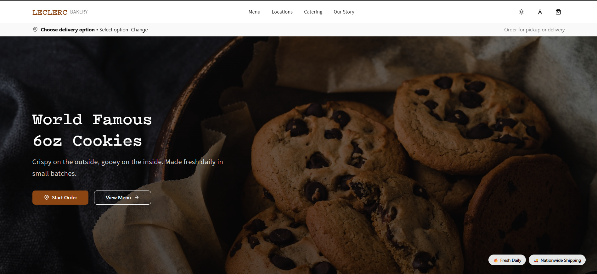
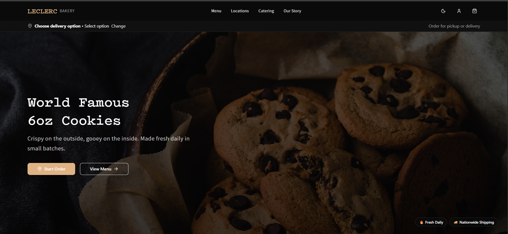
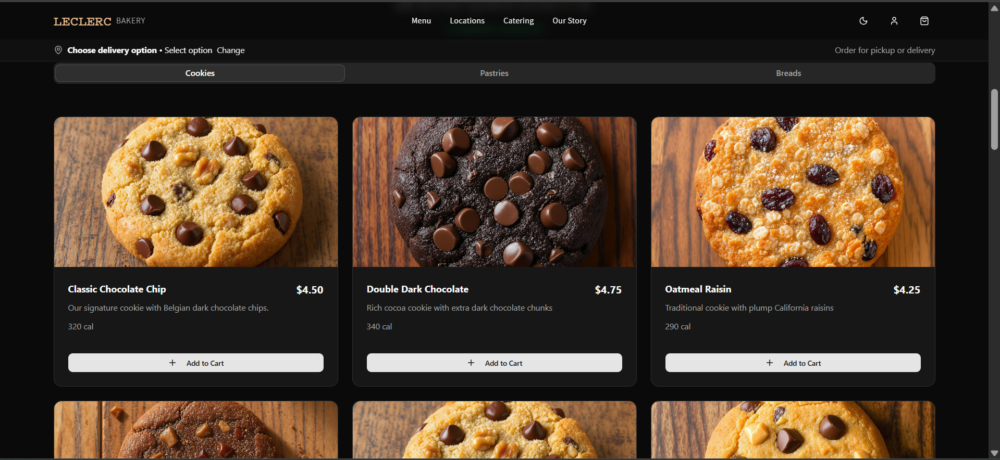
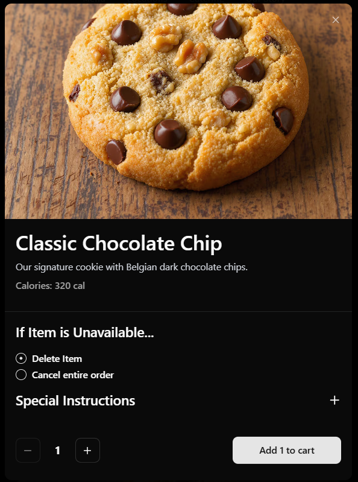
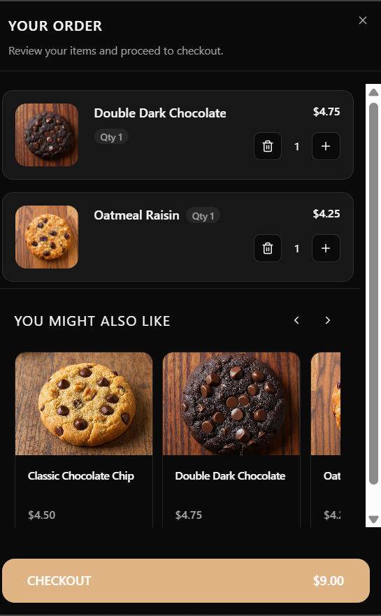

# Crave.js – Leclerc Bakery Storefront Template

Leclerc Bakery is a production-ready Crave.js storefront built with Next.js 15, React 19, and Tailwind CSS. It delivers a polished ordering journey—hero storytelling, rich menu browsing, accessible product dialogs, and a mobile-first cart—optimized for fast deployment on Vercel with CraveUp’s ordering APIs.

---

## Key Features

- **CraveUp Ordering Stack** – Integrates the CraveUp Storefront SDK for live menus, cart mutations, and checkout handoffs.
- **Rich Menu Experience** – Sticky category navigation, featured carousel, and responsive cards with hover states.
- **Product Dialog & Drawer** – Desktop dialogs and mobile drawers share the same content for parity and accessibility.
- **Cart & Recommendations** – Persistent sidebar/cart drawer with quantity controls, item notes, and CTA for checkout.
- **Theme Ready** – Light/dark palettes, brand tokens, and easily adjustable typography in Tailwind.
- **Accessible UI** – Built on shadcn/ui + Radix primitives, ensuring keyboard navigation and screen-reader friendliness.

---

## Demo

| Hero (Light)                                     | Hero (Dark)                                    |
| ------------------------------------------------ | ---------------------------------------------- |
|  |  |

| Menu Grid                                      | Product Dialog                                           |
| ---------------------------------------------- | -------------------------------------------------------- |
|  |  |

| Cart Sidebar                                         |
| ---------------------------------------------------- |
|  |

---

## Tech Stack

- [Next.js 15 (App Router)](https://nextjs.org/)
- [React 19](https://react.dev/)
- [TypeScript](https://www.typescriptlang.org/)
- [Tailwind CSS](https://tailwindcss.com/)
- [shadcn/ui + Radix UI](https://ui.shadcn.com/)
- [CraveUp Storefront SDK](https://docs.craveup.com/)

---

## Getting Started

1. **Clone the repo**
   ```bash
   git clone --depth=1 https://github.com/your-org/leclerc-bakery
   cd leclerc-bakery
   ```
2. **Install dependencies**
   ```bash
   pnpm install
   ```
3. **Configure environment variables** (see below).
4. **Run the dev server**
   ```bash
   pnpm dev
   ```
   Visit [http://localhost:3000](http://localhost:3000) to explore the storefront.

---

## Environment Variables

Start from the provided template:

```bash
cp .env.example .env.local
```

Replace the placeholders with your own credentials.

| Key                               | Required | Description                                                     |
| --------------------------------- | -------- | --------------------------------------------------------------- |
| `NEXT_PUBLIC_CRAVEUP_API_KEY`     | ✅       | Public API key from the CraveUp dashboard.                      |
| `NEXT_PUBLIC_LOCATION_ID`         | ✅       | Default location used for menus and cart operations.            |
| `NEXT_PUBLIC_GOOGLE_MAPS_API_KEY` | ✅       | Enables Google Maps for address autocomplete + delivery radius. |

Need sandbox access? Email [hello@craveup.com](mailto:hello@craveup.com).

---

## Scripts

| Command      | Description                           |
| ------------ | ------------------------------------- |
| `pnpm dev`   | Start the local development server    |
| `pnpm build` | Create the optimized production build |
| `pnpm start` | Serve the production build locally    |
| `pnpm lint`  | Run ESLint checks                     |

---

## Customization Guide

1. **Branding** – Replace imagery in `public/images` and update color tokens in `src/app/globals.css`.
2. **Copywriting** – Adjust hero, footer, story, and CTA text inside `src/app/components/`.
3. **Menu Data** – Manage categories/products within the CraveUp dashboard; the template consumes the live API response for `NEXT_PUBLIC_LOCATION_ID`.
4. **UX Enhancements** – Extend cart behavior or product options by editing hooks/providers under `src/hooks` and `src/app/providers`.
5. **Testing** – Run `pnpm lint` and `pnpm build` before shipping to catch regressions early.

---

## Project Structure

```
src/
|-- app/                # App Router routes, layouts, providers
|-- components/         # Hero, menu, cart, shared UI
|-- hooks/              # Cart + ordering session hooks
|-- lib/                # API clients, constants, utilities
`-- store/              # Zustand stores
public/                 # Images, screenshots, icons
README.md
```

---

## Deployment on Vercel

1. Push your changes to GitHub/GitLab/Bitbucket.
2. Visit [vercel.com/new](https://vercel.com/new) and import the repository.
3. Add the environment variables listed above in the project settings.
4. Deploy—Vercel installs via `pnpm`, runs `pnpm build`, and serves the production bundle.
5. Configure preview environments, analytics, and custom domains as needed.

---

## Support & Reference

- [CraveUp Docs](https://docs.craveup.com/)
- [Next.js Documentation](https://nextjs.org/docs)
- [Tailwind CSS Docs](https://tailwindcss.com/docs)
- [shadcn/ui Documentation](https://ui.shadcn.com/)

Need implementation help? Reach out to [hello@craveup.com](mailto:hello@craveup.com).

---

## License

Distributed under the MIT License — see [LICENSE](LICENSE) for details.
